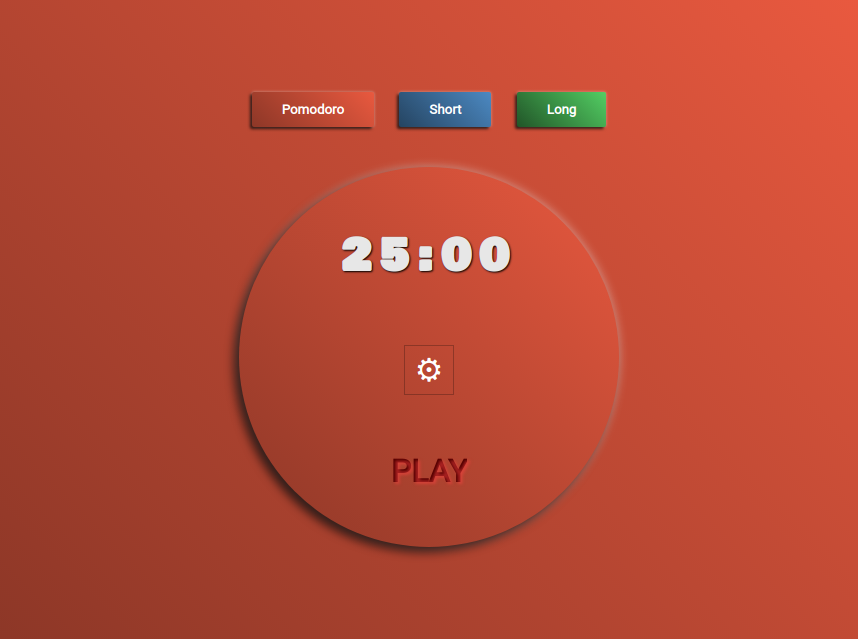

# Pomodoro

Como ultimamente estou estudando bastante offline, então resolvi fazer a minha versão do pomodoro.
É um app bem simples, com apenas HTML, CSS e JS.

## Demo



<br/>

Se quiser testar a aplicação click[aqui](https://)

## Começando

Se quiser rodar a aplicação na sua máquina recomendo usar o [Live Server](https://www.npmjs.com/package/live-server)<br/>

Para clonar o repositório:

```
git clone git@github.com:gabriellima77/Desafio-Front-End.git
cd Desafio-Front-End
```
